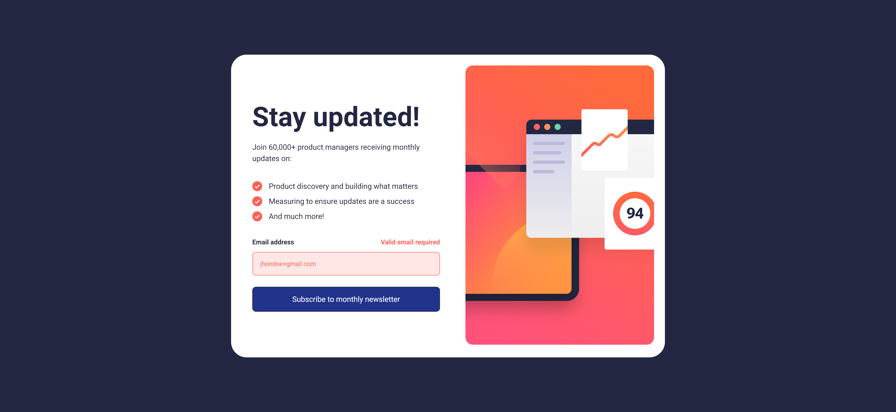
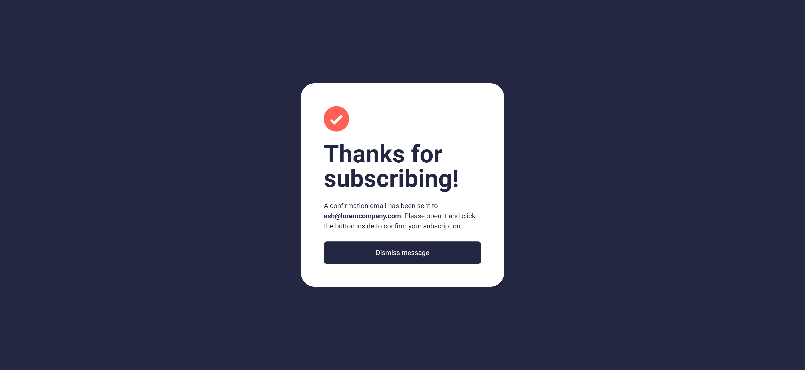

# Frontend Mentor - Newsletter sign-up form with success message solution

This is a solution to the [Newsletter sign-up form with success message challenge on Frontend Mentor](https://www.frontendmentor.io/challenges/newsletter-signup-form-with-success-message-3FC1AZbNrv). Frontend Mentor challenges help you improve your coding skills by building realistic projects. 

## Table of contents

- [Overview](#overview)
  - [The challenge](#the-challenge)
  - [Screenshot](#screenshot)
  - [Links](#links)
- [My process](#my-process)
  - [Built with](#built-with)
  - [What I learned](#what-i-learned)
  - [Continued development](#continued-development)
  - [Useful resources](#useful-resources)
- [Author](#author)

## Overview

### The challenge

Users should be able to:

- Add their email and submit the form
- See a success message with their email after successfully submitting the form
- See form validation messages if:
  - The field is left empty
  - The email address is not formatted correctly
- View the optimal layout for the interface depending on their device's screen size
- See hover and focus states for all interactive elements on the page

### Screenshot

### Links

- Solution URL: &nbsp; [Github](https://github.com/Y1a2s3h4/Newsletter-sign-up-form-with-success-message-solution)
- Live Site URL: &nbsp; [Vercel](https://newsletter-sign-up-form-with-success-message-solution-one.vercel.app/)

## My process

### Built with

- [React](https://reactjs.org/) - JS library
- CSS custom properties
- Flexbox

### What I learned

- My main focus while doing this challenge was to recap my designing ui and make pixel perfect as close as possible and making it responsive as given in the design.

- And I wanted to do some small animation kind of thing when submitted so I built using pure CSS.

### Continued development

- I think, more can be done here like making animation and functionality for dimissal popup too.

### Useful resources

- [Setting custom bullet](https://www.sitepoint.com/community/t/css-list-style-image-vertical-alignment-issue/5242) - This helped me for setting that "correct / tick / ✅" icon. I really liked this pattern and will use it going forward.

## Author

- Website - [Yash Purohit](https://yashpurohit.netlify.com/)
- Frontend Mentor - [@Y1a2s3h4](https://www.frontendmentor.io/profile/Y1a2s3h4)
- Twitter - [@__y1a2s3h4__](https://twitter.com/__y1a2s3h4__)

